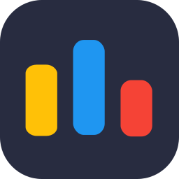

# Hey folks👋, I'm **Yuhesh Pandian** 
#### 🚀 Tech Enthusiast | Aspiring Developer | Creative Thinker | Lifelong Learner 🎯

---

## 👨‍💻 About Me

🤖 I’m currently building an marketplace backend made only for programmers.
📚 Expanding my skills in **Python, HTML, and CSS** to build innovative projects  
🤝 Open to collaborating with **tech enthusiasts**  
💡 Ask me about **the latest tech trends**  
⌨ Typing speed: **50-60 WPM—fast fingers, faster ideas!**  
😆 Fun fact: **My sense of humor is as sharp as my code!** 

## ⚒ Competencies and Utilities

#### LANGUAGES

#### VERSION CONTROL

#### DESIGN

#### IDE/EDITORS

#### AI & BOTS

#### BLOG

#### DEV FORUMS

#### FRAMEWORKS

#### HOSTING

#### OTHERS

## **📊 Github Stats**

  

 
  
  
  
  
  
  
  
  
  

  

## 🔗 Connect with me

---

