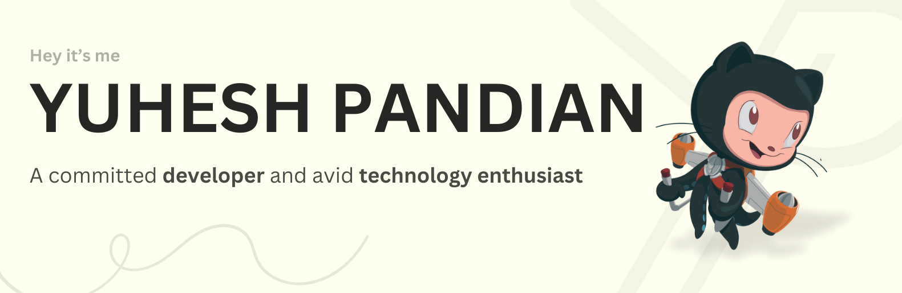

  

---

## 🚀 About Me

🤖 I’m developing **a smart virtual assistant**  
📚 Expanding my skills in **Python, HTML, and CSS** to build innovative projects  
🤝 Open to collaborating with **tech enthusiasts**  
💡 Ask me about **the latest tech trends**  
⌨ Typing speed: **50-60 WPM—fast fingers, faster ideas!**  
😆 Fun fact: **My sense of humor is as sharp as my code!** 
 

---

